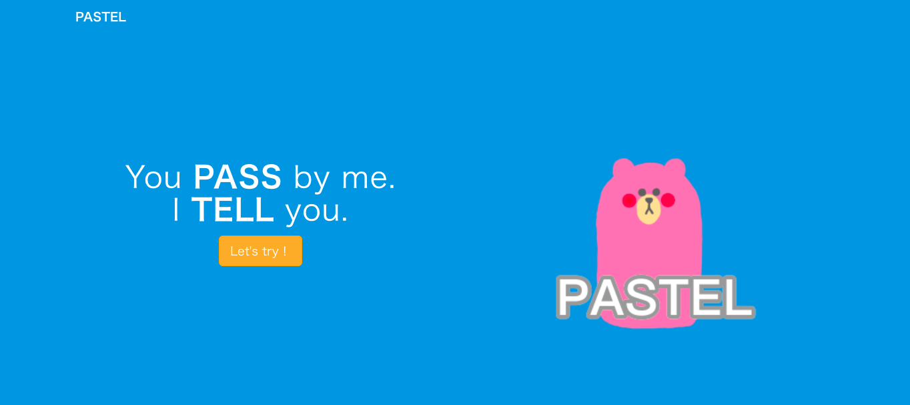
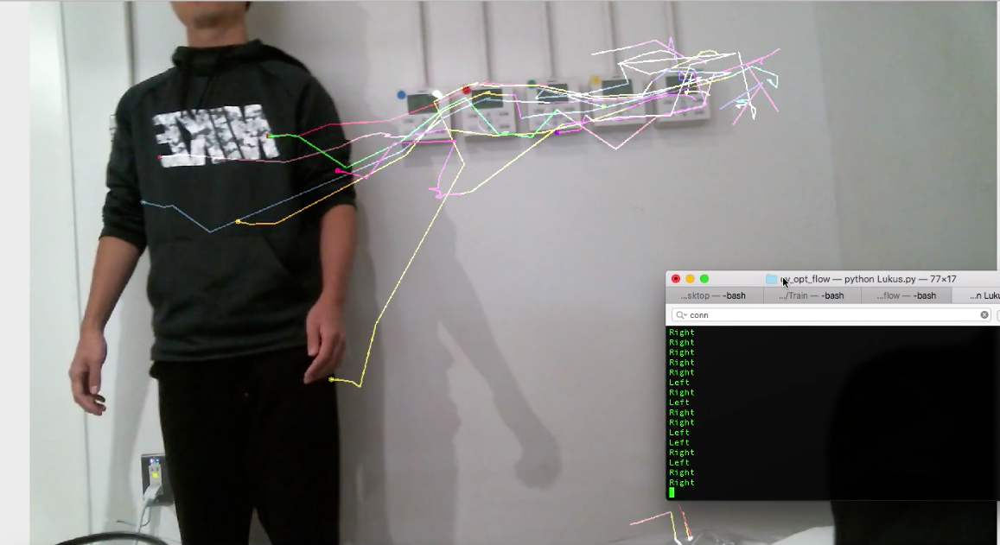

# パステル

## デモ動画

## 製品概要
### X Tech（見守り x Tech）

### 背景（製品開発のきっかけ、課題等）
#### 今回のプロダクトの開発に至った背景

多くのオフィスや研究室では鍵の施錠を労働者が自分で行うが、最後に職場を離れる人がその役目を担う場合が多い。

また多くの場合、最後に施錠する人は長時間の労働に疲弊し、人気のない職場で心寂しさを持つ人も少なくない。

そのため労働者の心のケアと長時間労働の見守りから心のケアにつながるソリューションが社会的に望まれつつある。

また働き方改革の流れでも言われている、長時間労働への関心も高まっており担当者や責任者が社員の事実上の労働状況を把握したいというニーズもある。

#### 着目した顧客・顧客の課題・現状を記入してください

職場の施錠を行う場合、誰がいま職場に残っているのかを確認し、鍵を閉めるかどうかの判断をすることがある。

広い職場であれば様々な部署を周り確認する必要があり、また確認忘れによって不法侵入や閉じ込められる人が出てくるなどのトラブルが発生する可能性がある。

設備の導入を検討している担当者も、現状では高額な設備投資によりカードシステム等を導入するか警備員を巡回させる必要があり、もっと簡易なシステムで導入しやすい入退室管理システムは望まれている。

### 製品説明（具体的な製品の説明）
LINE社が発売するLINE Clova、webベースの入退室管理システム、種々のセンサー、の３つから構成されている入退室管理システムである。

カメラや音声で人の検出を行い、だれが入退室をしたのかの情報を取得する。

カメラ認識ができない場合は、LINE Clovaで話しかけを行い、人の判断を行なう。

退出の際、その人以外誰も残っていない場合は、鍵の開け閉めを促すような声掛けを行う。

また人ごとの入退室のログを保持することにより、お疲れ様、今日は早いね、などの適切な声かけを行うことが可能で
あり、ユーザにとって親しみやすいシステムとなる。

またLINE Botを用いて遠隔で入退室システムにアクセスができるようになり、管理者が社内等の情報をより簡単に把握することができる。

### 特長

#### 1. 動画像を用いた個人の特定
カメラに写っている顔の情報から個人識別に有用な特徴量を抽出し、その特徴量に基づいて個人の特定を行っている。

またOptical Flowという手法を用いることで、一つのwebカメラから入退室のどちらに該当するかという推定を行っている。これにより本体の小型化と低価格化が実現できる

#### 2. 入退室の履歴が一目で分かる
専用のwebアプリを用いることにより、登録されているユーザの入退室履歴を一目で確認することができる。

webアプリには様々なapiをもち、開発者によりさらなる拡張も可能となっている。

#### 3. 監視されている感じがしない
可愛らしいデザインをしたLINE Clovaを用い社員にとって共感できるような声かけを行うことにより、監視されている感覚が減り親近感がわく設計を心がけた。

### 解決出来ること

職場から外出、帰宅する際に部屋に他の人がいるかどうかを確認しに行く手間を省くことができる。

最後であるということを退出者に伝えることで、中に人がいるかどうかの確認作業を短縮することができ、効率よく戸締りを行うことができる。

また、誰がどこにいるかを質問することもでき、用事のある人がどこにいるかの見当をつけることもできコンタクトコストを減少させることができる。

### 今後の展望
不審者の出現を写真として管理者や、社員のLINEへ通知するような拡張機能を追加することができる。

その場合LINE Clovaはトリガーとなる発話が必要である。今回は、発話のトリガーとして予め録音した音声を使用し、人が近づいて来た際に手動で録音音声を再生した。しかし、実際に運用していくためには、センサによる人の接近の感知や画像から人の速度を取得して接近するタイミングを予測するなどして、トリガーの発話をシステムによって自動的に行えるようにする必要がある。

また、今回は個人の特定に統合されていないが、音声から個人を特定するAIを実装した。
そのため、声紋認証と顔認証の統合し、マルチモーダルな認識を実装することで、人間のように多様な状況下でも正確な個人認証を行えるようになるだろう。

## 開発内容・開発技術

* 機械学習を用いた顔画像からの個人識別技術とそのアプリケーション
* 新しいユーザを追加し再学習するアプリケーションの開発
* 機械学習を用いた音声からの個人識別技術とそのアプリケーション
* 動画からの人の移動方向ベクトルの取得と、入退室検出システムへの応用
* ユーザ登録、入退室履歴の参照等可能な管理者向けwebアプリケーション開発
* webアプリケーションとLINEClova、LINEbotの連携アプリケーション

### 活用した技術
* カスケード分類器:顔認識
* Optical Flow:人の移動方向の検出
* SSD(高速なニューラルネットワークモデル):人・物体検出
* サポートベクターマシン,ニューラルネットワーク:声紋認証

#### API
* LINE Clova
* LINE BOT

#### フレームワーク・ライブラリ・モジュール
* Python : 顔認識, 人の移動方向の検出, 人・物体検出, 声紋認証の実装に使用
	* Opencv
	* Scikit-learnn
	* Keras
* Ruby on Rails:サーバの構築に使用
* HTML

#### デバイス
* Clova
* USBカメラ
* スピーカー
