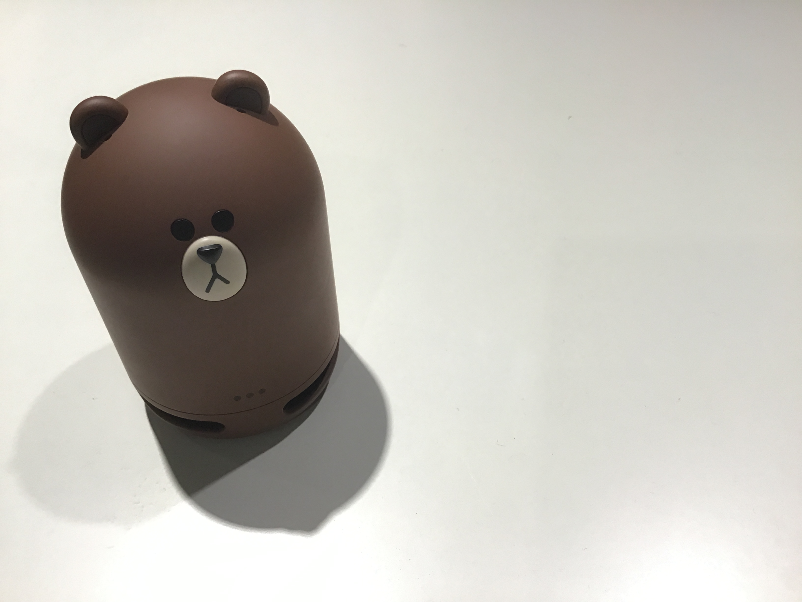

# パステル

## 製品概要
### X Tech（見守り x Tech）

### 背景（製品開発のきっかけ、課題等）
- こんかいのプロダクトの開発に至った背景

多くのオフィスや研究室では、鍵の施錠を労働者が自分で行うが、最後に職場を離れる人がその役目を担う場合が多い

また多くの場合、最後に施錠を行う人は長時間の労働に疲弊しており、人気のない職場での仕事に心寂しさを持つ人も少なくない

そのため労働者の心のケアと長時間労働の適切な監視から始まる体のケアにつながるソリューションが社会的に望まれつつある

また働き方改革の流れでも言われている、長時間労働への関心も高まっており担当者や責任者が社員の事実上の労働状況を把握したいというニーズもある

- 着目した顧客・顧客の課題・現状を記入してください

職場の施錠を行う場合、誰がいま職場に残っているのかを確認し、鍵を閉めるかどうかの判断をすることがある

広い職場であれば様々な部署を周り確認する必要があり、また確認忘れなどがセキュリティ的な弱さを生み出したり閉じ込められる人が出てくる可能性がある

設備の導入を検討している担当者も、現状では高額な設備投資によりカードシステム等を導入するか警備員を巡回させる必要があり、もっと簡易なシステムで導入しやすい入退室管理システムは望まれている

### 製品説明（具体的な製品の説明）
LINE社が発売するLINE Clova、webベースの入退室管理システム、種々のセンサー、の３つから構成されている入退室管理システムである

カメラや音声で人の検出を行い、だれが入退室をしたのかの情報を取得する。

カメラ認識ができない場合は、LINE Clovaで話しかけを行い、人の判断を行なう。

退出の際、その人以外誰も残っていない場合は、鍵の開け閉めを促すような声掛けを行う。

また人ごとの入退室のログを保持することにより、お疲れ様、今日は早いね、などの適切な声かけを行うことが可能で
あり、ユーザにとって親しみやすいシステムとなる

またLINE Botを用いて遠隔で入退室システムにアクセスができるようになり、管理者が社内等の情報をより簡単に把握することができる

### 特長

#### 1. 声紋と動画像を用いた個人の特定
音声情報と顔情報から個人識別に有用な特徴量を抽出し、マルチモーダルな検出を行なっている。

また動画像からOptical Flowという手法を用いることで一つのwebカメラから入退室のどちらに該当するかという推定を行っている。これにより本体の小型化と低価格化が実現できる

#### 2. 入退室の履歴が一目で分かる
専用のwebアプリを用いることにより、登録されているユーザの入退室履歴を一目で確認することができる

webアプリには様々なapiをもち、開発者によりさらなる拡張も可能となっている

#### 3. 監視されている感じがしない
可愛らしいデザインをしたLINE Clovaを用い社員にとって共感できるような声かけを行うことにより、監視されている感覚が減り親近感がわく設計を心がけた

### 解決出来ること

職場から外出、帰宅する際に部屋に他の人がいるかどうかを確認しに行く手間を省くことができる

最後であるということを退出者に伝えることで、中に人がいるかどうかの確認作業を短縮することができ、効率よく戸締りを行うことができる

また、誰がどこにいるかを質問することもでき、用事のある人がどこにいるかの見当をつけることもできコンタクトコストを減少させることができる

### 今後の展望
不審者の出現を写真として管理者や、社員のLINEへ通知するような拡張機能を追加することができる。

その場合LINE Clovaはトリガーとなる発話が必要である。そのため、人の接近を感知してトリガーとなる発話を他のスピーカから音声を流すことでスキルを起動させるのが良い。人の接近はセンサを用いて実装できる

また声紋認証と顔認証の統合にはさらなる調整が必要である

## 開発内容・開発技術

* 機械学習を用いた顔画像からの個人識別技術とそのアプリケーション
* 新しいユーザを追加し再学習するアプリケーションの開発
* 機械学習を用いた音声からの個人識別技術とそのアプリケーション
* 動画からの人の移動方向ベクトルの取得と、入退室検出システムへの応用
* ユーザ登録、入退室履歴の参照等可能な管理者向けwebアプリケーション開発
* webアプリケーションとLINEClova、LINEbotの連携アプリケーション

### 活用した技術
ニューラルネットワーク
Optical Flow
顔画像認識(カスケード分類器)
オブジェクト抽出(YOLO)
サポートベクターマシン

#### API・データ
今回スポンサーから提供されたAPI、製品などの外部技術があれば記述をして下さい。

*LINE Clova
*LINE BOT

#### フレームワーク・ライブラリ・モジュール
* Opencv
* Keras
* Scikit-learnn
* Ruby on Rails

#### デバイス
* Clova
* USBカメラ
* スピーカー
